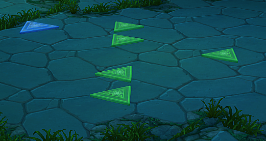
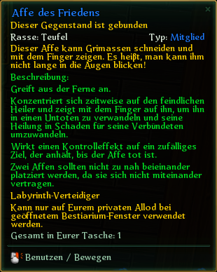
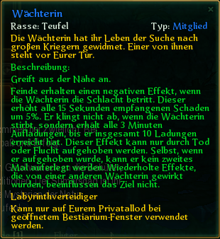

# Allods Online

- [Allods Online](#allods-online)
  - [Labyrinth](#labyrinth)
    - [Räume](#räume)
    - [Verteidiger](#verteidiger)
      - [Affe des Friedens](#affe-des-friedens)
      - [Wächterin](#wächterin)
      - [TODO: Auge](#todo-auge)
      - [TODO: Mimik](#todo-mimik)
    - [Fallen](#fallen)
    - [Auren](#auren)
    - [Aufwertungskosten 15.0](#aufwertungskosten-150)
  - [Reittiere](#reittiere)
    - [Farbschattierungen und wo man sie findet](#farbschattierungen-und-wo-man-sie-findet)
      - [Manabike / Schweberad](#manabike--schweberad)
      - [Lightning Bolt / Blitschlag](#lightning-bolt--blitschlag)

## Labyrinth

### Räume

In einem Labyrinth können bis zu neun Räume gebaut werden. 
Um einen Raum innerhalb eines Labyrinthes bauen zu können benötigt man Astralgranit. Dieses kann im Tausch gegen Embrium erhalten werden. 
Ein Labyrinth kann drei verschiedene Raumtypen enthalten: 

- Gang
- Gabelung
- Kreuzung

Je mehr man von einer Sorte baut, desto teurer werden die Kosten für diesen Raum. Der Typus des Raumes bestimmt die Anzahl der Ausgänge zu weiteren Räumen und die Anzahl der Plätze für die Verteidiger. Bereits gebaute Räume können nur durch zwei Möglichkeiten verändert werden. (1. Kompletter Abriss des Labyrinths gegen Echtgeld oder 2. durch Schriftrollen der Verteidigerplatzänderung als Belohnung  der vorherigen Saison). 

| Typus    | Eingänge | Ausgänge | Verteidigerplätze |
| -------- | -------- | -------- | ----------------- |
| Gang     | 1        | 1        | 1-3               |
| Gabelung | 1        | 2        | 2-3               |
| Kreuzung | 1        | 3        | 3                 |

Verteidigerplätze werden zufällig von einen Algorithmus  beim Bau des Ganges erstellt. Jeder Verteidiger hat eine Seltenheitsstufe und kann auf dem entsprechenden Verteidigungsplatz gestellt werden. 

Hier ein Beispiel für einen Verteidigerplatz 

### Verteidiger

Verteidigerplätze werden zufällig von einen Algorithmus  beim Bau des Ganges erstellt. Jeder Verteidiger hat eine Seltenheitsstufe und kann auf dem entsprechenden Verteidigungsplatz gestellt werden.

#### Affe des Friedens

#### Wächterin

#### TODO: Auge

#### TODO: Mimik

### Fallen

### Auren

### Aufwertungskosten 15.0

| Stufe | Goldkosten |
| ----- | ---------- |
| 01    | 272920     |
| 02    | 331473     |
| 03    | 399586     |
| 04    | 477345     |
| 05    | 565937     |
| 06    | 666318     |
| 07    | 779503     |
| 08    | 906523     |
| 09    | 1048469    |
| 10    | 1206465    |
| 11    | 1381683    |
| 12    | 1575331    |
| 13    | 1788647    |
| 14    | 2022925    |
| 15    | 2279503    |
| 16    | 2559747    |
| 17    | 2865066    |
| 18    | 3196919    |

Summe: 24.324.360 Gold pro Raum auf Stufe 18

## Reittiere

### Farbschattierungen und wo man sie findet

#### Manabike / Schweberad

| Name (EN)            | Name (DE) | Quelle                               |
| -------------------- | --------- | ------------------------------------ |
| End of Eternity      |           | Teps Pyramide                        |
| Bronze Age           |           | Mausoleum der Funken                 |
| June Dune            |           | Tka Riks Cave                        |
| Blizzard             |           | New Years Celebration (Winter Event) |
| Currents of Infinity |           | Boutique                             |

#### Lightning Bolt / Blitschlag

| Name (EN)     | Name (DE) | Quelle                         |
| ------------- | --------- | ------------------------------ |
| Absolute Zero |           | Winter Holidays (Winter Event) |